# 简介

先构建三叉链表，将元素值，双亲，左子树，右子树，存入链表中，然后进行查询，最后输出结果。

# 环境

Visual Studio 2019

# 程序框图

## 总体

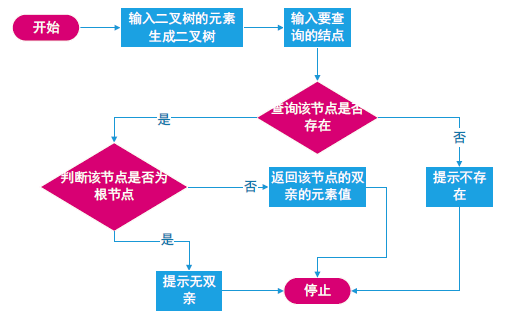

## 生成空树

## 销毁树

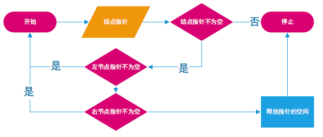

## 先序输入无双亲指针的二叉树

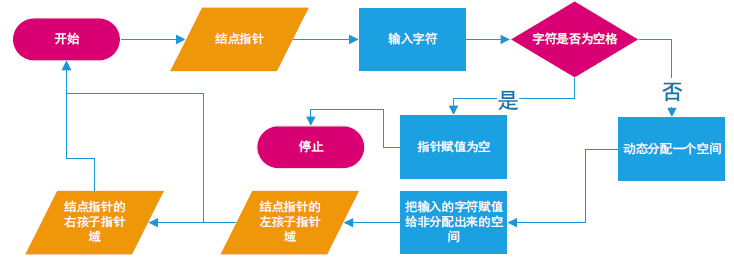

## 创建队列

## 判断空队列

## 插入队列元素

## 出队

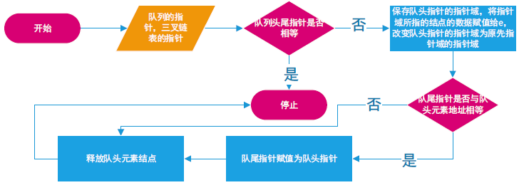

## 先序输入构造三叉链表表示的二叉树

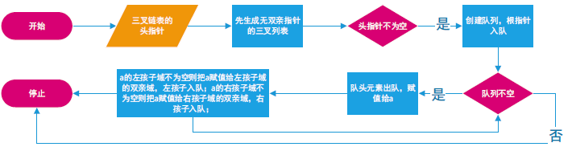

## 返回树中指向元素值为e的结点的指针

## 先序递归遍历

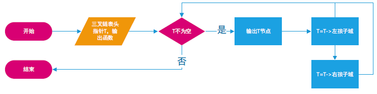

## 中序递归遍历

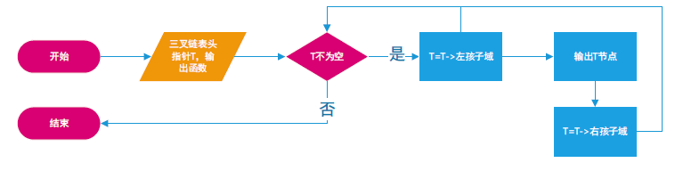

## 后序递归遍历

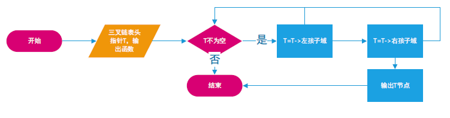

## 层序递归遍历

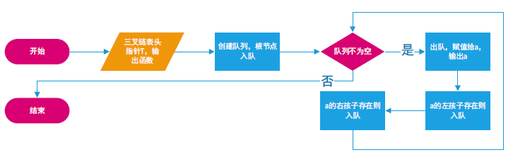

## 非递归先序递归遍历

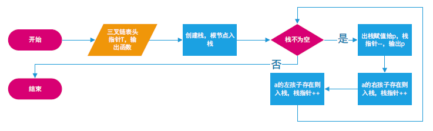

## 非递归中序递归遍历

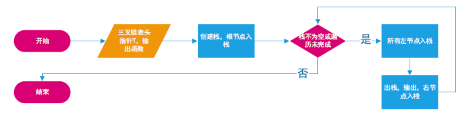

## 非递归后序递归遍历

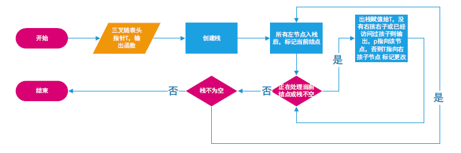

## 函数调用关系图

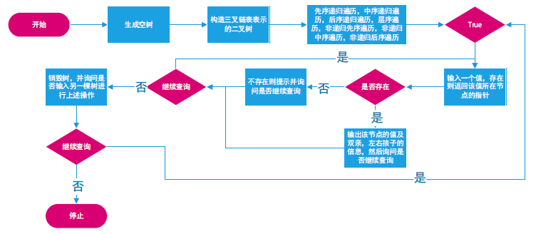

# 使用说明

## 建树

先序输入二叉树的元素值

`ab空空cdf空空g空空e空h空空`

输入的二叉树如图所示

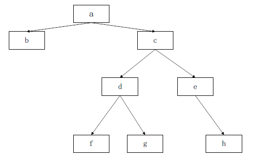

## 遍历

### 先序遍历

a是根节点

b是a的左孩子

c是a的右孩子

d是c的左孩子

f是d的左孩子

g是d的右孩子

e是c的右孩子

h是e的右孩子

### 中序遍历

b是a的左孩子

a是根节点

f是d的左孩子

d是c的左孩子

g是d的右孩子

c是a的右孩子

e是c的右孩子

h是e的右孩子

### 后序遍历
b是a的左孩子

f是d的左孩子

g是d的右孩子

d是c的左孩子

h是e的右孩子

e是c的右孩子

c是a的右孩子

a是根节点

### 层序遍历
a是根节点

b是a的左孩子

c是a的右孩子

d是c的左孩子

e是c的右孩子

f是d的左孩子

g是d的右孩子

h是e的右孩子

## 查找

### 输入

`d`

### 输出

d的双亲是c

d的左孩子是f

d的右孩子是g

### 输入

`i`

### 输出
树中不存在该节点

### 输入

`a`

### 输出
a没有双亲

a的左孩子是b

a的右孩子是c